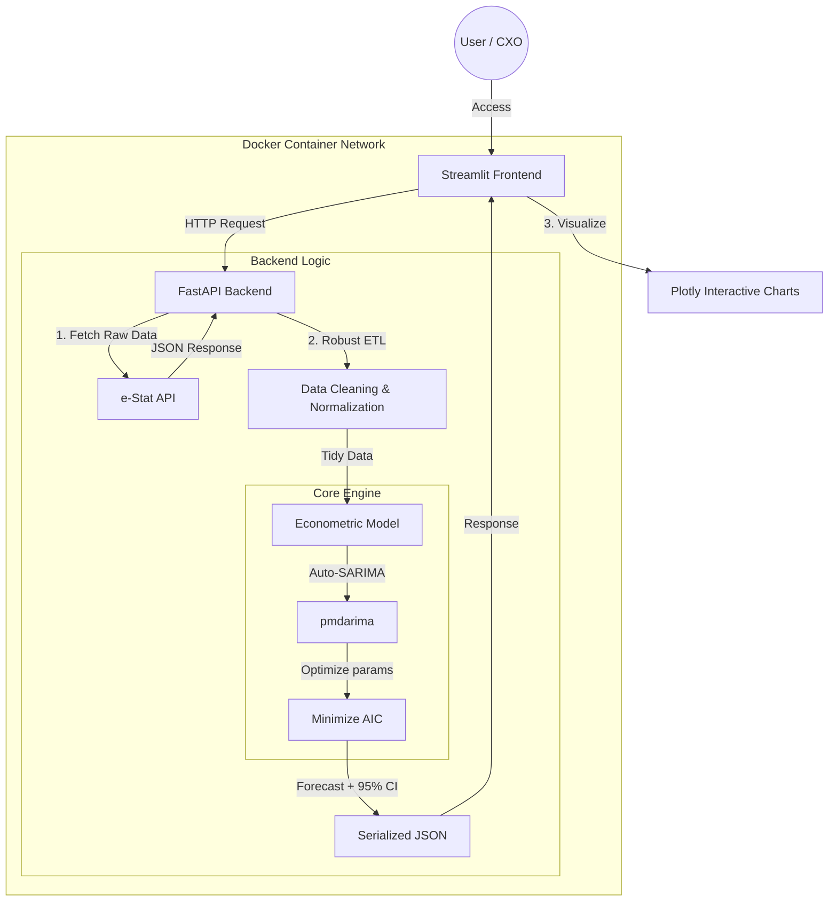

# Macro-Micro Linkage Platform

> **Bridging the gap between Macroeconomic Volatility and Corporate Profitability.**
>
> 公的統計（e-Stat）と経営シミュレーションを接続し、マクロ経済の「不確実性」を企業の「リスク」として定量化する意思決定支援プラットフォーム。

[](https://www.python.org/)
[](https://fastapi.tiangolo.com/)
[](https://www.docker.com/)

## The Problem: The "Macro-Micro" Disconnect

現代の経営環境において、CPI（消費者物価指数）やPPI（企業物価指数）の急激な変動は、もはや無視できない経営リスクです。しかし、多くの企業において、**「マクロ経済の予兆」と「自社のP/L（営業利益）へのインパクト」は分断されています。**

本プロジェクトは、公的統計のリアルタイム解析と計量経済学モデル（SARIMA）を融合させ、インフレリスクを個社の財務インパクトへ「翻訳」します。単なるデータ可視化ではなく、**「未来の不確実性に対する耐久力」を診断するSaaS**のMVP（Minimum Viable Product）です。

## Key Value Propositions

1.  **Defensive Data Engineering**:
    e-Stat API特有の非構造的で不安定なデータ形式（和暦、年度、不規則な数値列）に対し、堅牢なパースロジックを実装。ETLプロセスにおけるデータの整合性を完全に担保。
2.  **Scientific Forecasting**:
    ブラックボックスなAIではなく、統計的裏付けのある **Auto-ARIMA/SARIMA** を採用。予測の「95%信頼区間」を可視化することで、経営者がBest/Worstシナリオを想定できる設計。
3.  **Financial Grade UX**:
    PlotlyによるインタラクティブなFan Chart（ファンチャート）を実装。過去の実績から未来の予測レンジまでをシームレスに接続し、金融機関レベルの分析体験を提供。

---

## System Architecture

本システムは、Docker Composeを用いた疎結合なマイクロサービスアーキテクチャを採用しています。



---

## Technical Deep Dive

### 1. Defensive Data Engineering (The "Dirty Data" Challenge)

公的統計データは、歴史的経緯によりフォーマットが極めて不統一です（例: 「平成30年」「2018年度」「201804」が混在）。
本システムでは、あらゆるフォーマットの揺らぎを吸収する**防御的パーサー（Defensive Parser）**を独自実装し、プロダクトの可用性（Availability）を高めています。

```python
# snippet from app/services/estat_services.py
def parse_date_robust(x):
    s = str(x).strip()
    # Case 1: Japanese Eras & Fiscal Years
    if "月" in s: return pd.to_datetime(s.replace("年", "-").replace("月", "-01"))
    if "年度" in s: return pd.to_datetime(s.replace("年度", "-04-01"))
    
    # Case 2: Inconsistent Digit Formats (YYYYMM vs YYYYMMDD)
    if s.isdigit():
        if len(s) == 6: return pd.to_datetime(s, format="%Y%m")
        if len(s) == 8: return pd.to_datetime(s, format="%Y%m%d")
        
    return pd.to_datetime(s, errors='coerce')

```

### 2. Econometric Methodology: SARIMA & Diagnostics

AIトレンドに盲従せず、スモールデータ（月次マクロ統計）の性質と「説明責任」の観点から、Deep Learning（LSTM等）ではなく、統計的裏付けのある **SARIMA (Seasonal AutoRegressive Integrated Moving Average)** を採用しました。

#### A. Model Specification (SARIMA)
データの周期性（月次データの場合は $m=12$）を考慮し、以下の季節階差を取り入れたモデル構築を `pmdarima` により自動化しています。

```math
\Phi_P(L^m) \phi_p(L) (1-L^m)^D (1-L)^d y_t = c + \Theta_Q(L^m) \theta_q(L) \epsilon_t
```

Where:
- $(1-L^m)^D$: **季節性階差** (季節性の除去)
- $\Phi_P(L^m), \Theta_Q(L^m)$: **季節性自己回帰 (AR)/ 移動平均 (MA) 成分**
- Optimized via **AIC (赤池情報量基準) の最小化による最適化**


#### B. Model Diagnostics (Ljung-Box Test)
「モデルがデータ内の情報をすべて汲み尽くしたか（残差がホワイトノイズか）」を検証するため、**Ljung-Box検定** を実装しています。

$$
Q = n(n+2) \sum_{k=1}^h \frac{\hat{\rho}_k^2}{n-k}
$$

Where:
- $n$: The sample size (データ数).
- $\hat{\rho}_k$: The sample autocorrelation at lag $k$ (ラグ $k$ における標本自己相関).
- $h$: The number of lags being tested (検定するラグ数).

**Hypothesis Test 仮説検定（残差の診断）:**
- $H_0$（帰無仮説）: 残差は独立に分布している（ホワイトノイズ） **[モデルは妥当]**
- $H_1$（対立仮説）: 残差に自己相関が存在する **[モデルの再検討が必要]**

`EconometricEngine.diagnose()` メソッドは、$`p`$-value を算出し、統計的有意水準（$`\alpha=0.05`$）に基づいてモデルの信頼性を自動判定します。

#### C. Robust Preprocessing

時系列解析の前提条件（等間隔性）を担保するため、以下のETL処理を強制しています。

1. **Resampling**: 月次（`MS`）への正規化。
2. **Linear Interpolation**: 線形補間による欠損値の穴埋め。

```python
# Actual implementation in EconometricEngine
data = data.resample('MS').mean()
data = data.interpolate(method='linear')

```

---

## Tech Stack

| Category | Technology | Rationale |
| --- | --- | --- |
| **Backend** | Python 3.10, FastAPI | 型安全性(`Pydantic`)と非同期処理による高速なAPIレスポンス。 |
| **Data Science** | Pandas, Numpy, Pmdarima | 堅牢なデータ操作と、統計的に厳密な時系列解析の実装。 |
| **Frontend** | Streamlit | データの対話的操作とプロトタイピングの高速化。 |
| **Visualization** | Plotly | 金融グレードのインタラクティブなチャート描画。 |
| **Infrastructure** | Docker, Docker Compose | 環境差異を排除し、`docker-compose up` 一発でのデプロイを実現。 |

---

## Setup & Usage

開発環境の再現性を担保するため、Docker Composeによるワンコマンド起動を実現しています。

### Prerequisites

* Docker & Docker Compose installed

### Quick Start

```bash
# 1. Clone the repository
git clone [https://github.com/soomorita/macro-micro-linkage.git](https://github.com/soomorita/macro-micro-linkage.git)
cd macro-micro-linkage

# 2. Set up environment variables
# Copy the example file and add your E-STAT API Key
cp .env.example .env

# 3. Ignite the engine
docker-compose up --build

```

Access the dashboard at: `http://localhost:8501`

---

## Future Roadmap

* **Multivariate Analysis**: VARモデル（ベクトル自己回帰）導入による、複数経済指標の相互作用分析。
* **Sector-Specific Models**: 業界ごとの「原価率」「価格転嫁力」のプリセット実装。
* **Real-time Alerting**: 統計発表直後にSlack/Emailへリスクアラートを通知する機能。

---

### Author

**soomorita**

### References

本プロジェクトの技術的・理論的基盤となったリソースです。

* **Data Source**: [e-Stat API (Portal Site of Official Statistics of Japan)](https://www.e-stat.go.jp/api/)
* **Library**: [pmdarima: ARIMA estimators for Python](https://alkaline-ml.com/pmdarima/)
* **Methodology**: Hyndman, R.J., & Athanasopoulos, G. (2018). *Forecasting: Principles and Practice*. OTexts.
```
